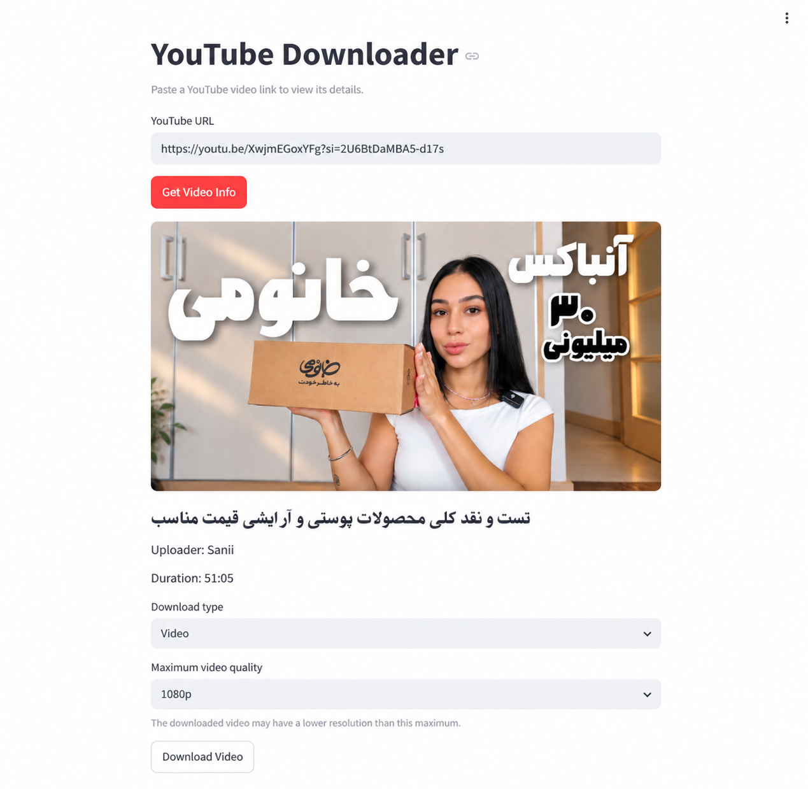

# YouTube Downloader

A Streamlit-based YouTube video and audio downloader built with Python, yt-dlp, and FFmpeg. This learning and portfolio project provides a local web interface for previewing video details, choosing download options, and saving completed files through your browser.

## Features

- Download individual YouTube videos with selectable maximum video quality based on available resolutions. The downloaded resolution may be lower than the selected maximum.
- Merge separate video and audio streams with FFmpeg when necessary.
- Download audio only in MP3 or M4A format.
- Preview the title, uploader, duration, and thumbnail when available.
- Save completed files through Streamlit's browser download button.
- Store downloaded files locally in `downloads/`; downloaded media is ignored by Git.
- Display input and download errors, and manage selections and completed downloads with Streamlit session state.
- Automated backend and interface tests using `unittest` and Streamlit AppTest.

## Tech Stack

- **Python** — application and backend logic.
- **Streamlit** — web interface and browser download controls.
- **yt-dlp** — metadata extraction, format selection, and downloading.
- **FFmpeg** — video/audio merging and audio conversion or remuxing.
- **Node.js** — JavaScript runtime configured for yt-dlp downloads.
- **unittest** and **Streamlit AppTest** — automated testing.

## Project Structure

```text
youtube-downloader/
├── app.py                    # Streamlit interface
├── src/
│   ├── __init__.py
│   └── downloader.py         # Metadata, quality selection, and downloads
├── tests/
│   ├── test_app.py           # Interface and session-state tests
│   ├── test_audio.py         # Audio download tests
│   └── test_downloader.py    # Metadata, quality, and video download tests
├── downloads/
│   └── .gitkeep              # Keeps the local output directory in Git
├── requirements.txt         # Pinned Python dependencies
├── .gitignore
└── README.md
```

## Requirements / Prerequisites

### System dependencies

- **Python 3.12 or newer**, with `pip` and virtual environment support, for the pinned dependencies. The current local environment uses Python 3.14.7.
- **FFmpeg**, available on `PATH`, for merging streams and audio conversion/remuxing.
- **Node.js**. The current download backend explicitly expects the executable at `/usr/bin/node`.
- **Git** to clone the repository, an internet connection to access YouTube, and a browser to use the interface.

The setup below targets Linux/WSL. Install these system tools before creating the Python environment. The Node path is a Linux/WSL-specific assumption and is not portable across all operating systems or Node installation methods.

### Python dependencies

`requirements.txt` contains the pinned Python packages, including Streamlit and yt-dlp. Install them inside a virtual environment as shown below. FFmpeg and Node.js must be installed separately; installing the Python requirements does not install these system tools. `unittest` is part of Python's standard library.

## Installation (Linux/WSL)

Replace `<repository-url>` with the actual GitHub clone URL. The explicit destination directory keeps the following commands consistent regardless of the repository name.

```bash
git clone <repository-url> youtube-downloader
cd youtube-downloader
python3 -m venv .venv
source .venv/bin/activate
python -m pip install -r requirements.txt
```

Make sure `python3` refers to a version compatible with the requirements above. Run the remaining commands from the project directory with the virtual environment activated.

## Verify FFmpeg and Node.js

```bash
ffmpeg -version
node --version
which node
```

The version commands should succeed. Check that Node is available at `/usr/bin/node`, as configured in `src/downloader.py`. If `which node` reports another location, verify `/usr/bin/node` separately; a Node executable elsewhere on `PATH` does not satisfy the backend's explicit path setting. If needed, install Node at the expected location or adjust the backend configuration for your environment.

## Running the App

```bash
streamlit run app.py
```

Open the local URL shown by Streamlit in your browser. To activate the environment again in a new terminal, run `source .venv/bin/activate` from the project directory.

## Usage

1. Enter an individual YouTube video URL in **YouTube URL**.
2. Click **Get Video Info**.
3. Preview the title, uploader, duration, and thumbnail when available.
4. Choose **Video** or **Audio** under **Download type**.
5. For video, select **Maximum video quality**. For audio, choose **MP3** or **M4A** under **Audio format**.
6. Click **Download Video** or **Download Audio** and wait for processing to finish.
7. Click **Save video to your device** or **Save audio to your device** to save the completed file through your browser.

Completed files are also kept in the project's `downloads/` directory. The app displays the filename and size, plus the actual video quality or selected audio format. Changing the URL or download options clears the previous browser-save result.

## Testing

With the virtual environment activated, run from the project root:

```bash
python -m unittest discover -s tests -v
```

The suite covers metadata handling, format selection, video and audio download behavior, validation, error handling, and Streamlit interface/session-state behavior. Tests use mocked services, synthetic metadata, and temporary files; they do not verify live YouTube downloads or real FFmpeg conversion.

Latest local verification (2026-09-23): **47 tests passed** on Python 3.14.7.

## Limitations

- Only individual video URLs are supported; playlist downloading is not supported.
- Download availability and quality depend on the formats YouTube exposes. A selected maximum resolution is a cap, not a guarantee of that resolution.
- FFmpeg is required for merging separate streams and audio conversion/remuxing.
- The current `/usr/bin/node` assumption targets Linux/WSL and may need adjustment on other setups.
- YouTube and yt-dlp behavior can change over time, so extraction or downloading may require dependency or configuration updates.
- This is a learning/portfolio project intended for local use; production readiness has not been established.

## Screenshots



## Legal / Responsible Use

Users are responsible for downloading only content they own, have permission to download, or are otherwise legally allowed to use, and for complying with applicable terms and laws.
